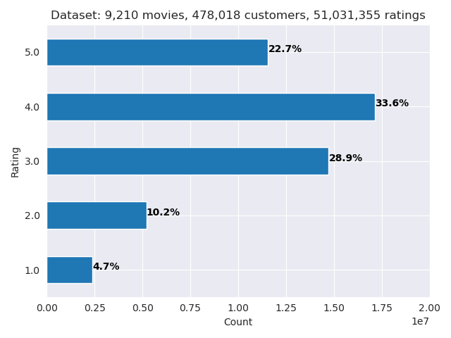
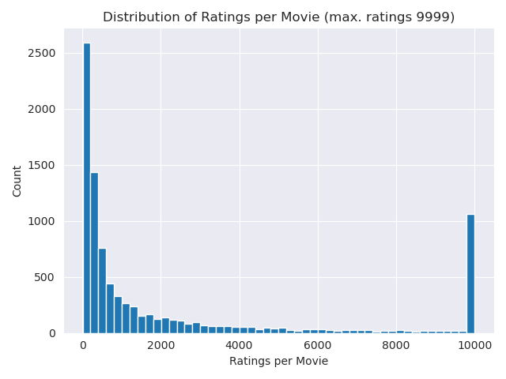

# Netflix Challenge (In Progress)
Side project where I try to build a recommender engine. Data is from the Netflix Prize and can be downloaded from Kaggle (see `data` folder for more information). 

# Goal
The main goal is creating an algorithm to **predict user ratings** for different movies. As a bonus, we will make movie suggestions by showing a list of movies with the highest predicted rating for a given user.

# Methods
Data was manipulated using Python (Pandas, NumPy) in Jupyter Notebook. Because of the massive size of this dataset, only about half the data was used to build the recommender. 

Once data was processed, the Surprise package was used to predict the ratings given by different users. More specifically, we used the SVM algorithm to model the ratings. To make movie suggestions, first a list of movies that have not been rated by a user was created. Then, we predict the ratings for each movie on that list, and recommend the top _n_ unrated movies. 

# Data Exploration and Processing
Even years after the original Netflix Prize, this dataset can still be considered really large and there are issues associated with handling this amount of data - processes take longer to run, and the computer may not have enough memory to handle all the data. For those reasons, only the `combined_data_1.txt` and `combined_data_2.txt` files were parsed. 

The figure below gives an idea of the size of the dataset. Using the two data files mentioned previously, there are 9,210 movies, 478,018 unique customers, and 51,031,355 ratings. From this figure, we can also notice that the rating distribution is not normal. A possible explanation for this is that people are not interested in watching a movie with bad reviews/ratings, so consequently fewer low ratings are given. 



Another aspect we can consider is how many ratings a given movie has received. This is shown in the image below. For readability, 



To try and make the dataset more manageable, we follow two different approaches:
* **Filter out movies that have been reviewed very few times.** This reduces the dataset size and also noise in the rating distribution. 
* **Filter out users that have given out very few ratings.** The contribution from these users may not be as valuable when making predictions because they haven't reviewed enough movies. This will also reduce the size of that dataset.

# Modeling and Results
When using the Surprise package, a few steps must be taken. We need to instantiate a `Reader` with the ratings scale, and also load the `Dataset` - in this case, from a pandas dataframe. Once that is done, we can proceed as usual - splitting train and test datasets, fitting the model, and making predictions.

For validation, the `cross_validate` method can be used. By doing so, the model has a root mean square error (RMSE) of 0.794 and a mean absolute error (MAE) of 0.618 (rating scale from 1 to 5).

As mentioned above, we could use this model to recommend movies to a user. Starting from the principle that movies that have not been rated are new to a user, we could recommend the movies with highest predicted rating. To do this, a function is created where different customer IDs can be fed as an argument. In addition to providing the customer ID, the function needs:

* An algorithm to predict movie ratings
* A pandas dataframe with ratings from a specific customer for a specific movie
* A pandas dataframe with movie IDs and respective names
* The number of movies `n` to recommend to the customer of interest

For example, for customer ID `243963`, this is the output of the function:
```
Top 5 item recommendations for customer 243963:
["Jackie Brown: Collector's Series"] 4.554576227070159
['Top Gun'] 4.538850035246383
['Bringing Out the Dead'] 4.345026027708397
['Eraser'] 4.334005363817438
['RoboCop'] 4.301776570037857
```

# Challenges
The main challenge with this project was handling the massive dataset without running out of memory. One way to overcome this is by reducing the amount of data being used, although this can limit the accuracy of the model. Another issue is that the recommended movies may not be relevant to this user - in that case, it would be better to used a mixed approach where we also consider movies that have been highly rated by other customers who share similar viewing behaviour to the customer of interest. 